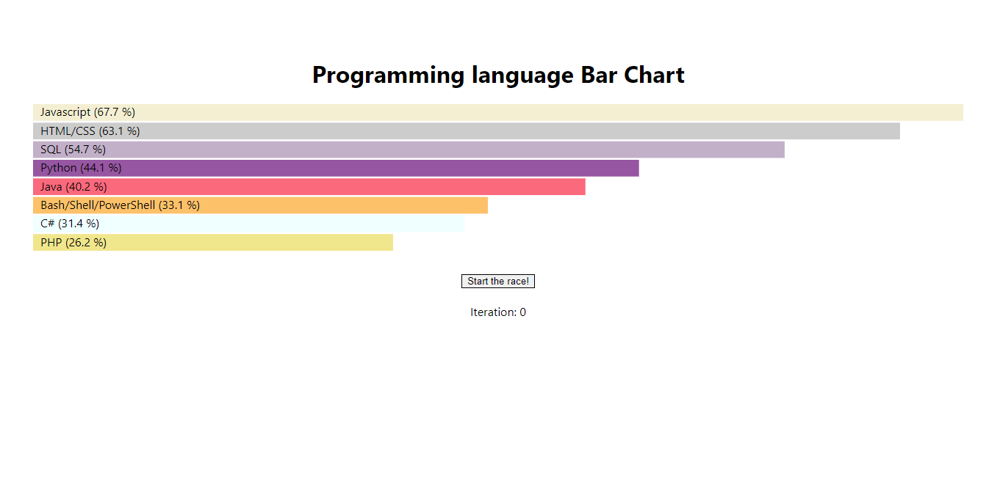

# Bar chart using D3 and React

## this repo contains code for horizontal bar chart for percentage programming languages used by developer

## used [Reactjs](https://reactjs.org/) and [d3](https://d3js.org/) libraries to create

### preview

